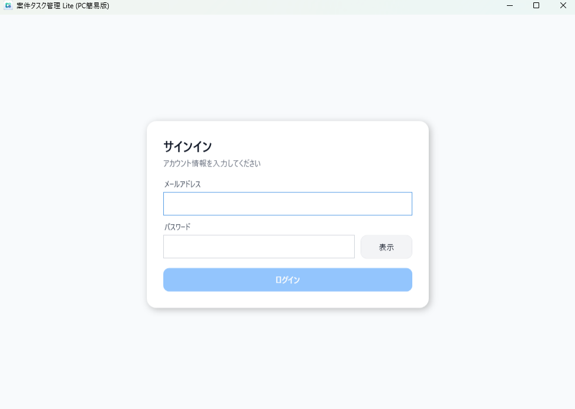
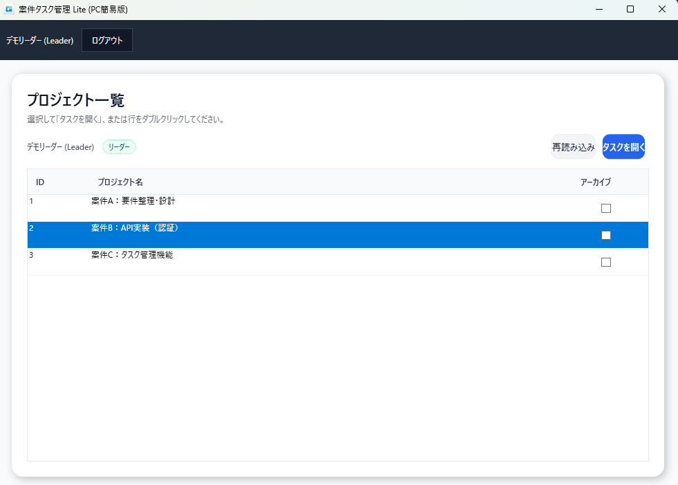
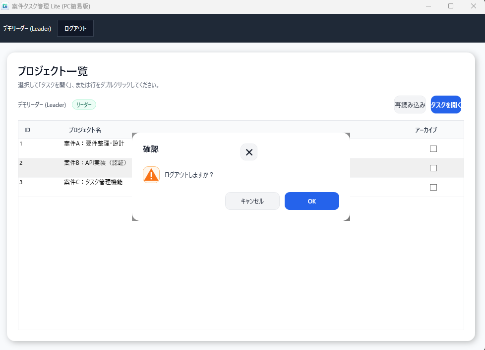
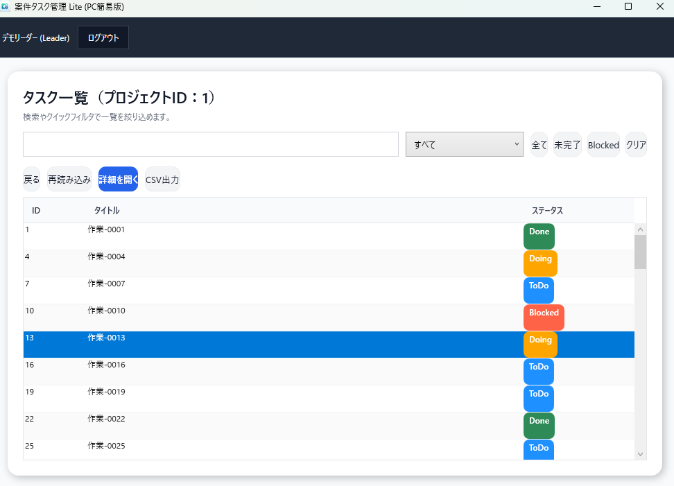
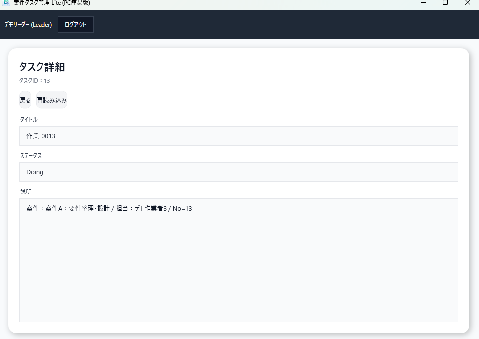
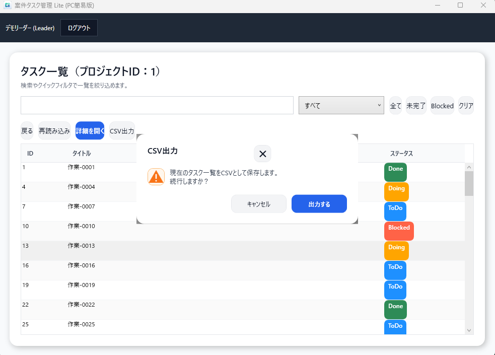

# 案件タスク管理 Lite（WPF Desktop Client）


> ASP.NET Core Web API を利用する **案件・タスク管理（Lite）の WPFデスクトップ版クライアント**です。  
> API側で **状態遷移ルール・権限制御（Leader / Member）** を一元管理し、WPFはクライアントとして疎結合に構成しています。

- **対象**：Windows業務アプリ想定（WPF / MVVM）
- **特徴**：API疎結合 / テスト可能設計（`IApiClient`）/ CIで `dotnet test`
- **できること**：ログイン / 案件一覧 / タスク一覧 / タスク詳細 / CSV出力 / ログアウト

**関連リンク**
- Backend(API)：https://github.com/fewioaghwrao/TaskStatusTransitionValidation-API  
- Frontend(Next.js)：https://github.com/fewioaghwrao/TaskStatusTransitionValidation-Front
- Frontend(Razor)：https://github.com/fewioaghwrao/TaskStatusTransitionValidation_Razor

---

# 🖥 スクリーンショット

| 画面 | スクリーンショット |
|---|---|
| ログイン |  |
| 案件一覧 |  |
| ログアウト確認 |  |
| タスク一覧 |  |
| タスク詳細 |  |
| CSV出力確認 |  |

---

# 🚀 Quick Start（ローカル起動）

## 前提
- Windows 10/11
- .NET SDK 8.x
- バックエンドAPIが起動していること（ローカル or デモ）

## 設定ファイル
`TaskStatusWpf/appsettings.json` を用意し、APIのBaseUrlを設定します。(例)

```json
{
  "Api": {
    "BaseUrl": "https://localhost:7039"
  }
}
```
## 起動
```bash
cd TaskStatusWpf
dotnet restore
dotnet run
```

## 動作確認

本クライアントを利用するには、バックエンドAPI側にログイン可能なユーザーが登録されている必要があります。  
ローカル検証時は、バックエンド側で用意した初期データ（開発用ユーザー）を利用してください。

確認手順:
1. バックエンドAPIを起動
2. 開発用ユーザーを投入した状態にする
3. `TaskStatusWpf/appsettings.json` に API の BaseUrl を設定
4. WPF クライアントを起動してログイン

※ 利用する資格情報はローカル環境ごとに設定してください。

---

# 🧩 システム構成

```
+---------------------+
| WPF Desktop Client  |
+---------------------+
           |
           | HTTPS (REST API)
           v
+-------------------------+
| ASP.NET Core Web API    |
+-------------------------+
           |
           v
+---------------------+
| SQL Server          |
+---------------------+
```

WPF クライアントは  
**業務ロジックを持たない API クライアント構成**としています。

---

# 📦 主な機能

### 認証

- APIログイン
- JWTトークン保持
- ログアウト

### 案件管理

- 案件一覧取得
- 案件選択

### タスク管理

- タスク一覧取得
- タスク詳細表示
- CSV出力

---

# 🔁 タスク状態

API側の業務ルールに従います。

| Status | 説明 |
|------|------|
| ToDo | 未着手 |
| Doing | 作業中 |
| Blocked | 作業停止 |
| Done | 完了 |

状態遷移ルールは **API側で検証**されます。

---

# 🧱 アーキテクチャ

MVVMパターンで構成しています。

```bash
Views
↓
ViewModels
↓
Services
↓
API Client
```

主なクラス

```bash
Services
├ ApiClient
├ IApiClient
└ AppSession

ViewModels
├ LoginViewModel
├ ProjectsViewModel
├ TasksViewModel
└ TaskDetailViewModel
```

---

# 🧪 テスト

xUnit を利用した **ユニットテスト**を実装しています。

対象

- ViewModel
- セッション管理
- APIクライアント

テストは **CI上で自動実行**されます。

---

# ⚙ CI（GitHub Actions）

CIでは以下を自動実行しています。

```bash
dotnet restore
dotnet build
dotnet test
```


対象

- .NET 8
- Windows Runner

---

# 🛠 技術スタック

| 技術 | 内容 |
|------|------|
| .NET | .NET 8 |
| UI | WPF |
| パターン | MVVM |
| ライブラリ | CommunityToolkit.Mvvm |
| API通信 | HttpClient |
| バックエンド | ASP.NET Core Web API |
| テスト | xUnit |
| CI | GitHub Actions |

---

# 🎯 この実装の目的

本プロジェクトは

**業務アプリを想定したデスクトップクライアント実装例**

として作成しています。

特に以下を重視しています。

- APIとの疎結合設計
- MVVM構造
- テスト可能な設計（DI / Interface）
- CIによる品質担保

---

# 今後の拡張

- タスク編集
- タスク作成
- 状態変更
- オフラインキャッシュ
- 操作ログ
- 依存注入（DI）による Service 管理の改善

# 📚 Docs
- [Architecture](docs/ARCHITECTURE.md)
- [Testing](docs/TESTING.md)
- [Configuration](docs/CONFIG.md)